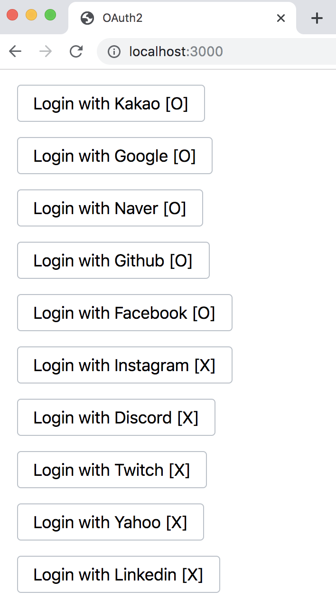
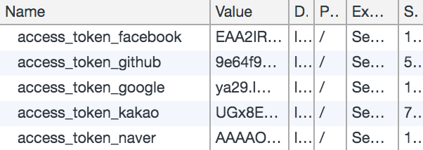

# oauth2-kit
> A very simple demo of OAuth2.0 Starter Kit



<br />



<br />

## Usage
```
$ yarn install

$ yarn start
```

## Vendors

> | Vendor                 | URL                                                                             |
> |------------------------|---------------------------------------------------------------------------------|
> | Kakao                  | https://developers.kakao.com/docs/restapi/user-management                       |
> | Google                 | https://developers.google.com/identity/protocols/OAuth2WebServer                |
> | Naver                  | https://developers.naver.com/docs/login/api                                     |
> | Github                 | https://developer.github.com/apps/building-oauth-apps/authorizing-oauth-apps    |
> | Facebook               | https://developers.facebook.com/docs/facebook-login/manually-build-a-login-flow |
> | Instagram              | https://www.instagram.com/developer/authentication                              |
> | Discord                | https://discordapp.com/developers/docs/topics/oauth2                            |
> | Twitch                 | https://dev.twitch.tv/docs/authentication                                       |
> | Yahoo                  | https://developer.yahoo.com/oauth2/guide/flows_authcode                         |
> | Linkedin               | https://docs.microsoft.com/linkedin/shared/authentication/authentication        |